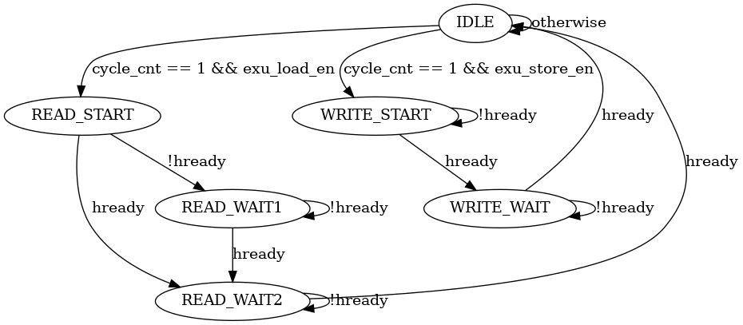

# mau_swc

## Overview

This module is the memory access module, which is the fourth level of the core pipeline. Based on the output control signals of the previous execution unit, it reads or writes to the memory through the AHB protocol and outputs the results to the next writeback module. In each pipeline cycle, this module monitors two signals: exu\_load\_en and exu\_load\_store\_en. If either of these signals is active, a load or store operation is initiated. These operations are implemented through a state machine. During a load operation, the states READ\_WAIT2 and READ\_WAIT1 are encountered, which are used for waiting for the transmission address and control signals, and for obtaining data, respectively. During a store operation, the WRITE\_WAIT state is needed to wait for the hready signal, which indicates that data can be written to the specified address. The transitions of this state machine are shown below.

## Signals

1. **`hclk`**: The hardware clock signal, driving the synchronous elements within the module.
2. **`hrstn`**: The hardware reset signal (active low), used to reset the state of the memory access unit.
3. **`cycle_cnt`**: An input signal representing the current cycle count, used for synchronization within the memory access operations.
4. **`haddr`**: An output register specifying the address for memory access on the AHB bus.
5. **`hwrite`**: An output register indicating whether the current AHB bus transaction is a write (1) or read (0) operation.
6. **`hwdata`**: The output register for data to be written to the memory system during write operations.
7. **`hsize`**: An output signal specifying the size of the data transfer on the AHB bus.
8. **`hburst`**: An output signal indicating the type of burst transfer on the AHB bus.
9. **`hprot`**: An output register specifying the protection level of the memory transaction.
10. **`htrans`**: An output register indicating the type of transaction on the AHB bus.
11. **`hmastlock`**: An output signal indicating if the bus master (MAU in this case) requires exclusive access.
12. **`hready`**: An input signal from the memory system indicating readiness to complete a transaction.
13. **`hresp`**: An input signal indicating the response status of the current transaction (success, error).
14. **`hrdata`**: The input data from the memory system.
15. **`exu_load_rd`**, **`exu_load_base_addr`**, etc.: Input signals from the Execution Unit (EXU) for load operations, including target register, base address, offset, sign extension flag, and load size.
16. **`exu_store_addr`**, **`exu_store_data`**, etc.: Input signals for store operations, specifying the address, data, size, and enable signal.
17. **`mau_load_rd`**, **`mau_load_data`**, **`mau_load_en`**: Output registers to hold the result of a load operation, including the target register, data, and an enable signal to indicate the completion of the load.